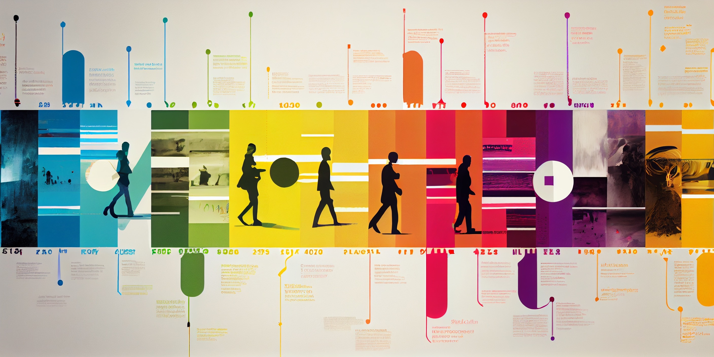

Are you tired of spending hours searching for customer information? You're not alone!

Many fast-growing companies struggle to know their customers well enough as customer information is typically fragmented across different teams. Research from McKinsey & Company shows that [customer teams spend 20-30% of their time looking for information][mckinsey], leading to confused customers and poor experiences.

<!--truncate-->

## The problem: fragmented customer information

With sales, marketing, customer success, and support teams holding different pieces of customer information, it's difficult to provide personalized experiences. This fragmentation impacts customer satisfaction, which [decreases by 13% for every additional minute a customer service representative spends searching for information][hbr].

## The solution:  Timeline

This is why we’re thrilled to introduce Timeline, a revolutionary tool that puts the entire history of your customer relationship at your fingertips.  This allows fast-growing teams to:

- **Solve customer problems on-the-spot**, as they understand the full context behind the issue.
- **Personalize the customer experience** by using their recent interactions with the company to guide the next best action.
- **Iterate faster** on building and delivering the solutions that customers actually need.

## How Timeline works: seamless integration with customerOS

Using Timeline is easy.  It’s built on top of customerOS, meaning you’re able to connect all of your favorite SaaS tools and databases.  Within minutes, you’ll have a complete picture of your customer relationship *as they experienced it* in real-time.  This allows you to solve customer problems quickly and efficiently because you have all the context you need to take immediate action.

## Transform your business with Timeline

With timeline, you’ll be able to see everything, including:

- What webpages your customers have visited
- All phone calls, emails, video calls – all conversations with your customers across every channel
- Purchase and payment history
- Customer notes, tickets, and more synced from 100+ 3rd party platforms like [Hubspot][hubspot] or [Zendesk][zendesk]
- Important documents and attachments, like invoices or contracts

…and more.  

Your customer experience is all about the shared moments between you and your customers.  With Timeline, your team will be able to craft a story that’s as unique and profoundly meaningful as every one of your customer relationships.  

## Ready to take your customer relationships to the next level?

Experience the benefits of Timeline for yourself!  [**Schedule a demo today**][demo] and revolutionize the way you engage with your customers.

<!---References--->

[demo]: /
[hbr]: https://hbr.org/2007/02/understanding-customer-experience
[hubspot]: /blog/hubspot-integration-customer-os/
[mckinsey]: https://www.mckinsey.com/capabilities/people-and-organizational-performance/our-insights/if-were-all-so-busy-why-isnt-anything-getting-done
[zendesk]: /blog/customer-os-zendesk-connector/
