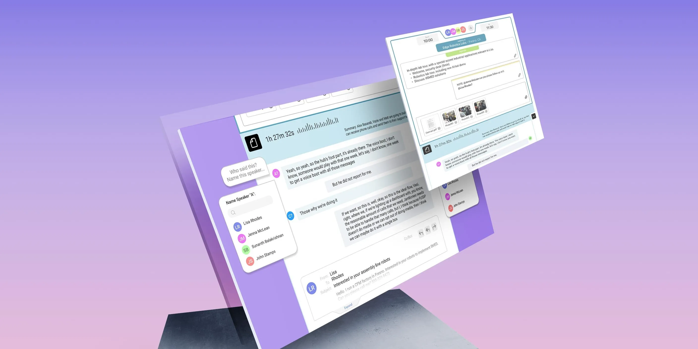

Let's talk about Meetings.

Customer meetings are at the heart of every organization.  Whether in-person or virtual, these meetings are vital for building relationships, gathering feedback, and discovering new business opportunities.  But getting the most out of meetings means planning, diligent note-taking, and effectively sharing meeting content across your team.  

By automating and optimizing meeting management, Meetings (built on customerOS) can give back each team member [4 hours a week][atlassian], allowing them 10% more time to focus on your business' core assets--the customers!

## A new era of meeting management

<!--truncate-->

Traditionally, meetings belong to the people who call them. Invitations, agendas, and minutes live wherever the host decides to store them. If the host didn't share them with you, finding them later can be a challenge.

This approach is outdated.

Customers belong to the business, and the meetings we hold with them are a key business asset.

That’s where Meetings comes in!

Meetings is an innovative, user-friendly tool for managing meeting notes and team collaboration. Bid farewell to disorganized notes and untidy spreadsheets, and embrace a platform that streamlines customer conversations for enhanced collaboration, communication, and satisfaction.

## Unlock the power of AI meeting notes

Meetings is your all-in-one tool for collaborating, planning, and extracting valuable insights from customer meetings. With Meetings, you can:

- Boost customer service by accessing a complete history of customer conversations, enabling personalized interactions and swift problem resolution. This can [increase customer retention rates by up to 15%][hbr].

- Strengthen internal communication and collaboration by sharing AI-generated meeting transcriptions, summaries, and action items across teams and departments. This is vital, as [86% of employees attribute workplace failures to poor collaboration and communication][collab].

- Automatically pinpoint action items and follow-up discussion topics to keep on top of your commitments.

## Maximize your virtual meetings

Make your customer interactions count with Meetings:

- Design meeting templates to pre-plan discussion topics, ensuring you cover all essential points and achieve your objectives. A clear agenda can [reduce meeting times by an impressive 80%][noty], freeing up time for other tasks.

- Upload and share recordings with ease while the customerOS AI engine automatically takes care of meeting transcription, conversation summary, and extracts key action items and follow-ups.

- Tag your teammates to keep them informed and engaged in the conversation.

## Embrace better customer conversations

Say goodbye to messy spreadsheets and disorganized notes. With Meetings, you can enhance collaboration, communication, and customer satisfaction. Ready to give it a try?

Click here to [schedule a demo][demo] and experience the true power of collaborative meeting managment!

<!---References--->

[atlassian]: https://www.atlassian.com/time-wasting-at-work-infographic
[collab]: https://blog.gitnux.com/communication-skills-statistics/
[demo]: /
[hbr]: https://hbr.org/2014/10/the-value-of-keeping-the-right-customers
[noty]: https://blog.noty.ai/how-to-stop-wasting-time-in-meetings-do-your-meetings-kill-your-productivity-47115538a11d
