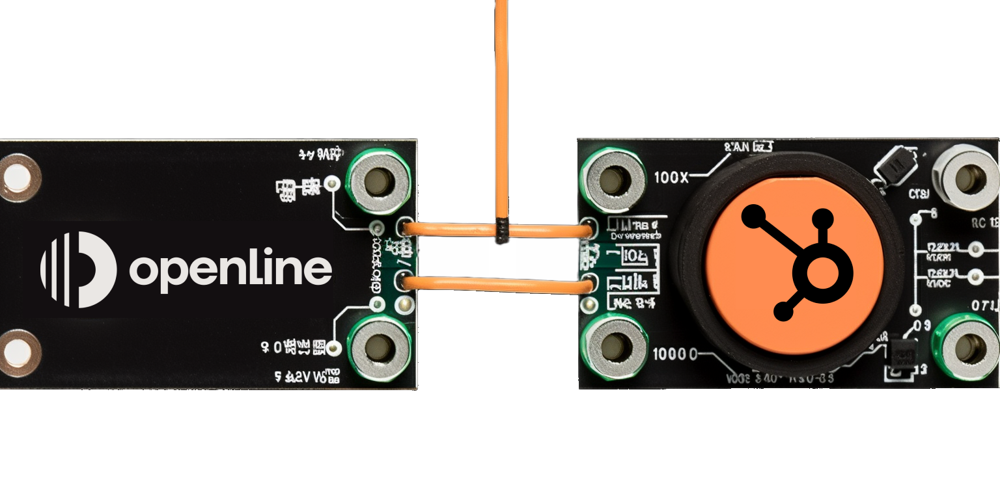

By the time a customer reaches your operational teams, A LOT has happened.  They’ve exchanged countless emails, virtual meetings, and other communications.  Proposals have been shared and agreed.  Contracts have been signed.

But how much of this crucial data makes it to your operational teams when it's time to hand off the customer?

<!--truncate-->

In today's customer-centric organizations, collaboration is key to creating the perfect customer journey. That's why we're excited to introduce our customerOS Hubspot integration. This powerful integration not only enhances your team's productivity and collaboration but also delivers measurable benefits that directly impact your bottom line. Say goodbye to paying for unnecessary CRM licenses and hello to seamless data synchronization and improved operational efficiency.

## The perks of the customerOS Hubspot integration

- Unified data view for smarter decision-making
- Better communication for top-notch customer satisfaction
- Streamlined collaboration across the business with easy access to vital conversations and documents
- Automatic updates for real-time accuracy
- Increased time savings and reduced expenses

## Make smarter decisions, faster

By integrating your Hubspot data with customerOS, your entire team gains access to essential customer information like contacts and organizations, comprehensive conversation history, and engagement details. This unified view, along with our unique [timeline functionality][timeline], enables your team to make informed decisions, quickly respond to customer needs, and effectively manage customer relationships.

And it’s crucial.  A [study by the MIT Sloan School of Management][sloan] found that data-driven organizations have **4% higher productivity and 6% higher profits** than their competitors.  Better data leads to better decisions, which ultimately results in better outcomes.

## Improved communication means happy customers

Great communication is the foundation of lasting customer relationships. With the Hubspot integration for customerOS, your team can access the full conversation history for each contact, including emails, phone calls, meetings, and more. This ensures that everyone is on the same page regarding promises and agreements made, helping improve client satisfaction and retention.

## Streamlined teamwork across functions

The customerOS Hubspot integration also equips your team with access to all files and attachments stored in Hubspot, enabling effortless sharing of essential documents like proposals, contracts, SLAs, and other materials exchanged during the sales process.

## Real-time precision

The Hubspot integration for customerOS automatically syncs all changes and new data from Hubspot.  This guarantees that your team is always working with the most up-to-date information, boosting accuracy and operational efficiency.

## Save time, save (a lot of) money

Using the customerOS Hubspot integration, you can ditch the CRM licenses for your operational teams. Plus, our integration helps your organization save an estimated [3.8 hours per week per customer-facing employee][forbes], resulting in a total of 9,880 hours saved annually for a 50-person team. With an average hourly wage of $30, **that's an impressive $296,400 in time savings!**

Experience the unmatched efficiency and ROI that the customerOS Hubspot integration brings to your organization. Equip your operational teams with the tools they need to drive customer success and maximize your business's growth.

**Ready to unleash the full potential of your operational teams? [Schedule a demo][demo] today and witness the difference with the customerOS Hubspot integration.**

<!---References--->

[demo]: /
[forbes]: https://www.forbes.com/sites/forbestechcouncil/2019/12/17/reality-check-still-spending-more-time-gathering-instead-of-analyzing/
[sloan]: http://ebusiness.mit.edu/research/papers/2011.12_Brynjolfsson_Hitt_Kim_Strength%20in%20Numbers_302.pdf
[timeline]: /blog/timeline-improves-customer-relationships/
