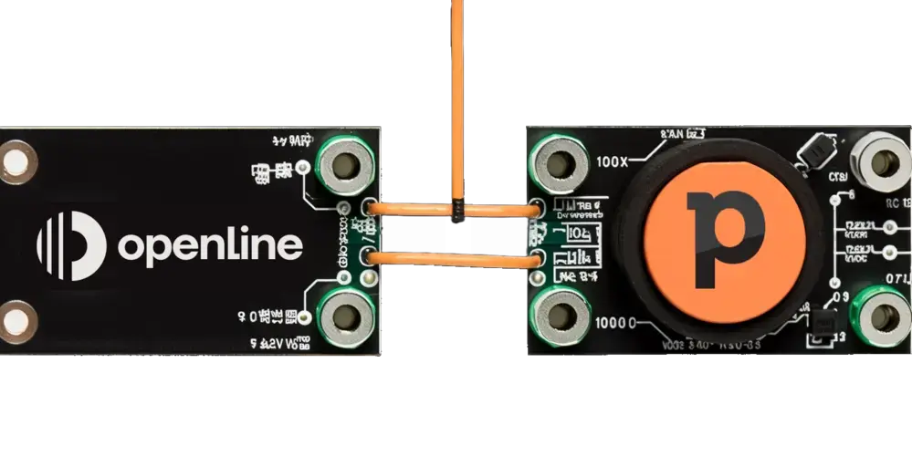

Before your Customer Success team even gets their hands on a new account, a whirlwind of interactions has taken place. A flurry of emails sent, virtual meetings held, and communication channels buzzing. Proposals have been swapped and agreements sealed. Signed, sealed, and delivered contracts are the norm.

But here's the million-dollar question: How much of this vital info actually lands in the hands of your Customer Success Managers (CSMs)?

<!--truncate-->
In our modern, customer-first landscape, smooth collaboration and efficient information sharing can't just be buzzwords - they're the lifeblood of successful businesses. And yet, the critical handoff from Sales to Customer Success can feel more like a game of hot potato than a well-orchestrated relay race. That's where our customerOS Pipedrive integration comes in.

Crafted with the challenges faced by Customer Success teams in mind, this integration makes the handoff process feel like a well-rehearsed dance. Say goodbye to communication hiccups and hello to seamless transitions and complete understanding of your customer's expectations. All the data you need to champion your customers' success is right there at your fingertips.

## What's in it for Customer Success leaders?

- **Seeing the whole picture:** Get a bird's-eye view of your pipeline. This lets you gear up for a seamless transition from sales to customer success.

- **A complete record of customer interactions:** Tap into a full history of interactions with your customers, including promises made and future opportunities. This crystal-clear record helps you grasp exactly what was sold and what the customer expects as they transition into your care.

- **Collaboration made easy:** With all the vital chats and documents within reach, your team can collaborate more effectively across the business.

- **Always up-to-date:** The integration automatically syncs all updates and new data from Pipedrive, so your team always has the freshest info.

- **Big-time savings:** Our Pipedrive integration helps you trim unnecessary costs and free up time, which can be better invested in driving customer success.

## Ace the customer handoff

Thanks to our Pipedrive integration, your entire team gets a crystal-clear view of what's in the pipeline. This view, combined with our unique [timeline functionality][timeline], allows you to anticipate and prepare for a flawless transition from sales to customer success.

## Know your customer's expectations inside out

The Pipedrive integration for customerOS delivers a comprehensive history of all customer interactions. You'll have emails, phone calls, meetings, and more right at your fingertips, ensuring you know exactly what was promised, what was sold, and what potential opportunities lie ahead. It's like having a crystal ball that lets you meet and exceed customer expectations from day one.

## Feel the difference with the customerOS Pipedrive integration

With the customerOS Pipedrive integration, you can say adios to CRM licenses for your customer success teams. Plus, our integration could help your organization save a whopping [3.8 hours per week per customer-facing employee][forbes]. That means a 50-person team could save a total of 9,880 hours annually. With an average hourly wage of $30, that's a jaw-dropping $296,400 in time savings!

- Elevate customer experiences.
- Boost your margins.
- Drive up operational efficiency.

Arm your teams with the tools they need to champion customer success and supercharge your business's growth.

**Ready to transform your customer success journey?**
[Schedule a demo][demo] today and see how the customerOS Pipedrive integration could be your game-changer.

<!---References--->

[demo]: /
[forbes]: https://www.forbes.com/sites/forbestechcouncil/2019/12/17/reality-check-still-spending-more-time-gathering-instead-of-analyzing/
[timeline]: /blog/customer-os-timeline-enables-customer-360/
