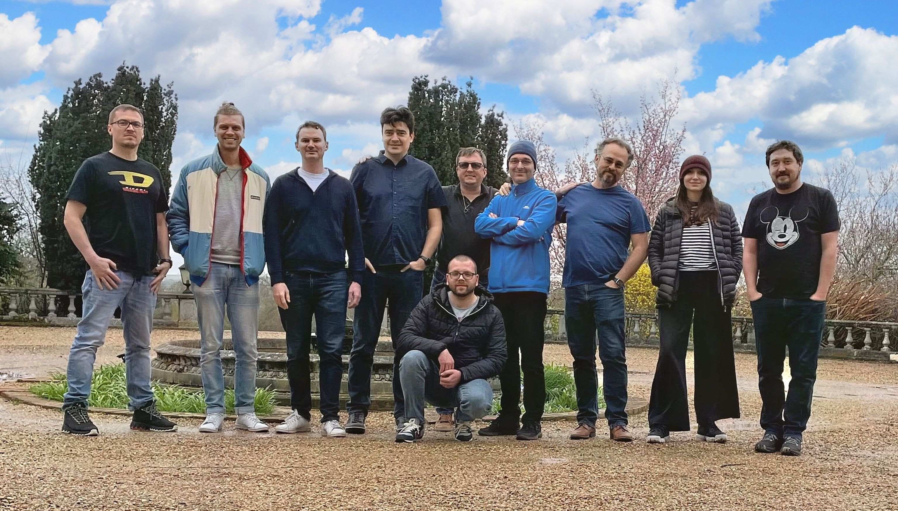
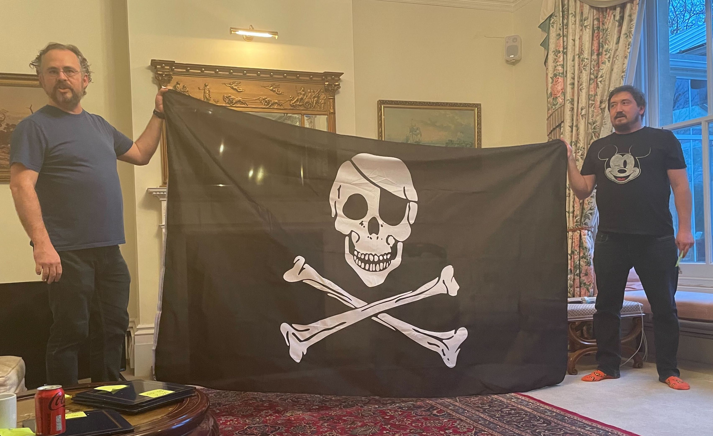

In today's fast-paced and interconnected world, bringing a diverse team of individuals together to share ideas, insights, and forge connections has become an integral part of successful teamwork. Our recent quarterly team offsite, held just outside Bedford, UK, provided the perfect opportunity for our international team members from six different countries to come together and share ideas. Over the course of three days, we delved into a range of topics, from our Super Secret Master Plan 🤫 to the role of agentive software in shaping our company's future.

<!--truncate-->

## Our super secret master plan
No successful offsite is complete without an ambitious master plan. Our team spent considerable time discussing and refining our Super Secret Master Plan, which focuses on driving the company towards even greater success. While we can't reveal too much at this stage, we can assure you that it entails a powerful blend of innovation, collaboration, and sheer determination.

## Communicating beyond verbal
In a world where communication is key, we explored alternative ways to connect with one another. By engaging in team-building exercises and creative workshops, we discovered the power of non-verbal communication and its impact on fostering a more inclusive and understanding work environment.

## Building a healthy feedback culture
Constructive feedback is the cornerstone of growth and development, both professionally and personally. Our offsite included workshops aimed at improving our feedback culture, focusing on methods that promote open, honest, and respectful communication. The result? A stronger, more resilient team that thrives on continuous improvement.

## An AI-first company
At the heart of our company lies the commitment to harness the power of artificial intelligence. We discussed strategies to further cement our position as an AI-first company, delving into the latest technological advancements and exploring their potential in revolutionizing our industry.

## The future of agentive enterprise software
Agentive software, which operates autonomously to assist users in achieving their goals, has become increasingly important in today's world. Our team explored the various ways in which agentive software can empower our clients and streamline our internal processes, ultimately enhancing our ability to deliver exceptional products and services.

Our quarterly team offsite was a testament to the importance of fostering a diverse, inclusive, and innovative work environment. By embracing the unique perspectives of our international team members, we continue to strengthen our collective knowledge, skills, and commitment to making a lasting impact in our industry. As we look to the future, we are excited to put our newfound insights and strategies into action, propelling our company towards even greater success.

Click here to [sign up for our waitlist][waitlist] and be one of the first to know how it feels to truly know your customer!  

<!---References--->

[hubspot]: https://www.openline.ai/guides/connectors/hubspot
[waitlist]: https://www.openline.ai/
[zendesk]: https://www.openline.ai/guides/connectors/zendesk-support
