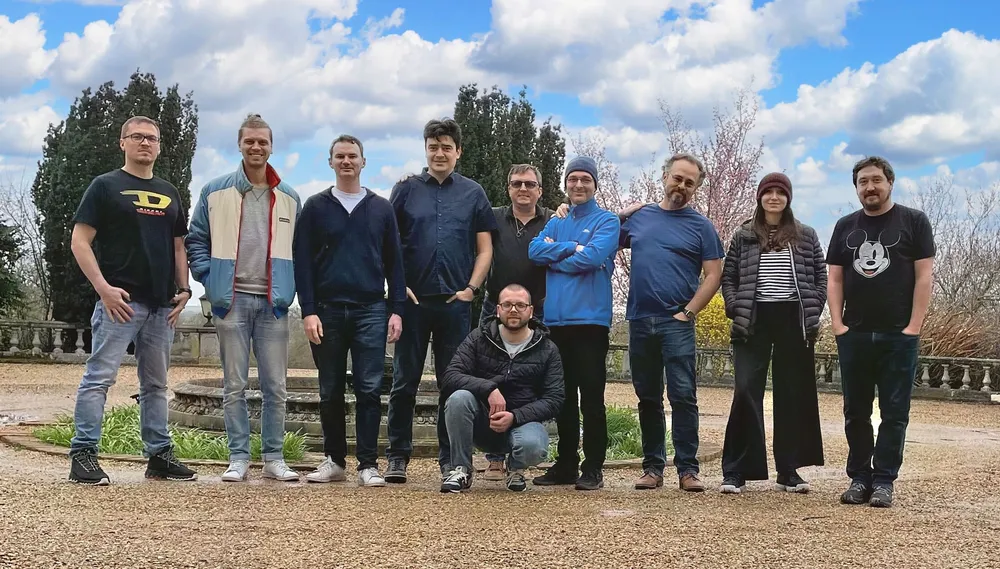
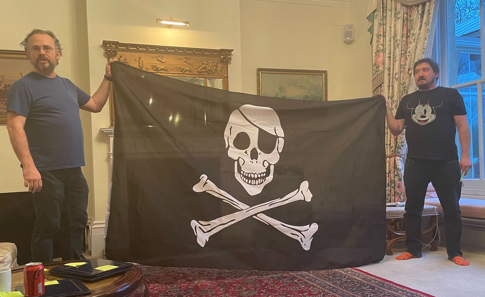

In today's fast-paced and interconnected world, bringing a diverse team of individuals together to share ideas, insights, and forge connections has become an integral part of successful teamwork. Our recent quarterly team offsite, held just outside Bedford, UK, provided the perfect opportunity for our international team members from six different countries to come together and share ideas. Over the course of three days, we delved into a range of topics, from our Super Secret Master Plan 🤫 to the role of agentive software in shaping our company's future.

<!--truncate-->

## Our super secret master plan

No successful offsite is complete without revisiting our ambitious super secret master plan™️. Don't tell anyone, but our plan consists of three stages:

1. Build an enterprise knowledge graph by bringing all your customer data together in one place.

2. Offer actionable insights to the business by enabling users to ask questions of the data (in natural language) and take action on the answers.

3. Implement agentive software that proactively takes the "next best action" for each customer and reports back on the outcomes.

While simple, executing the plan is no easy feat. We are excited by the challenges that await us as we strive to serve the customer-centric organizations of the future.

## Communicating beyond verbal

As a remote team spread across six different countries, our effectiveness is a direct function of our ability to communicate.  Problem is, good communication is really, really hard.  Particularly across language and cultural barriers.

In this session we learned that verbal communication, on average, has about a 50% loss rate during transmission.  In other words, when speaking with your colleague, we should only expect them to truly understand about half of what we said.  This was a huuuuuge eye opener!

To combat this, we engaged in exercises that help us bring other non-verbal means of communication (such as visual) into our daily practices to help reduce the information loss.  We found that sketches, recorded demos, and other visual aids significantly improved our ability to get our points across.  So far, this simple exercise has made a huge difference in how we work together.
## Building a healthy feedback culture

Constructive feedback is the cornerstone of growth and development, both professionally and personally. Our offsite included workshops aimed at improving our feedback culture, focusing on methods that promote open, honest, and respectful communication. The result? A stronger, more resilient team that thrives on continuous improvement.

Next time you see Antoine Valot, ask him about his world renowned POTATO framework 😆.

## Embracing an AI-first approach

There's no doubt that the speed of AI advancement in the past 18 months has been absolutely staggering.  We believe in 10 years, there will only be two types of companies:

- Those that are great at leveraging AI throughout the business, and 
- Those that are dead

As a startup, our advantage lies in our ability to adopt an AI-first mindset. AI already writes much of our core code and even helped write this blog post. So, how else can we embed AI within our organization's core? For instance, what would an AI-driven sales or finance organization look like?

We brainstormed numerous ways to leverage existing models to improve our day-to-day efficiency. As we grow, we'll move beyond putting AI at the core of our product to layering AI at the core of our operating model as well.

## Pioneering the future of agentive enterprise software

We believe the current wave of AI advancements will fundamentally change how we work. Knowledge workers will focus on building and disseminating knowledge instead of being bogged down by processes and workflows. Agentive software, which operates autonomously to assist users in achieving their goals, will enable them to harness their creativity. We are determined to stay at the forefront of this trend.

And no offsite is complete without a Pirate flag!  

Many companies proudly tout their "tight-knit family culture," with some even using cult-like language to describe their teams.

At Openline, we are not a family.  We're pirates.  We're a collection of misfits united by a common cause.  Together, we fight the status quo.  Our motley crew is a meritocracy where the best ideas win.  

No paternal posturing here.

We'll undoubtedly pick up new crew members along the way, and we'll lose some too.  But the mission doesn't change.  Not until we win.

<!---References--->

[hubspot]: /guides/connectors/hubspot/
[waitlist]: https://www.openline.ai/
[zendesk]: /guides/connectors/zendesk-support/
