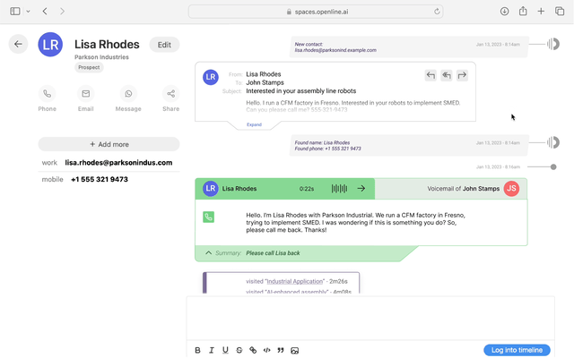

How well do you *actually* know your customers?

If you’re like most of the high-growth companies we talk to, the answer is probably not well enough.  Customer information is often fragmented across departments, with sales, marketing, customer success, and support all holding different pieces of the puzzle.  This can leave your customers… puzzled, and result in poor customer experiences and missed opportunities for growth.

<!--truncate-->

This is why we’re thrilled to introduce Timeline, a revolutionary tool that puts the entire history of your customer relationship at your fingertips.  This allows fast-growing teams to:

- Solve customer problems on-the-spot, because they understand the full context behind the issue.
- Personalize the customer experience by using their recent interactions with the company to guide the next best action.
- Iterate faster on building and delivering the solutions that customers actually need.

Using Timeline is easy.  It’s built on top of customerOS, meaning you’re able to connect all of your favorite SaaS tools and databases.  Within minutes, you’ll have a complete picture of your customer relationship *as they experienced it* in real-time.  This allows you to solve customer problems quickly and efficiently because you have all the context you need to take immediate action.

With timeline, you’ll be able to see everything, including:

- What webpages your customers have visited
- All phone calls, emails, video calls – all conversations with your customers across every channel
- Purchase and payment history
- Customer notes, tickets, and more sync’d from 100+ 3rd party platforms like [Hubspot][hubspot] or [Zendesk][zendesk]
- Important documents and attachments, like invoices or contracts

…and more.  

So why hasn’t anyone thought of this before? Perhaps because the playbook for startups is to target a small specific pain, address a specific silo’s technical need. But the business of being customer-centric is transversal, it does not belong to any departmental budget. Everyone gets a SaaS app, except for the customer.

This is why, instead of building another band-aid, we chose to focus on the fundamental, underserved core of your business. 

Your customer experience is all about the shared moments between you and your customers.  With Timeline, your team will be able to craft a story that’s as unique and profoundly meaningful as every one of your customer relationships.  

Interested in trying it out?  

Click here to [sign up for our waitlist][waitlist] and be one of the first to know how it feels to truly know your customer!  

<!---References--->

[hubspot]: https://www.openline.ai/guides/connectors/hubspot
[waitlist]: https://www.openline.ai/
[zendesk]: https://www.openline.ai/guides/connectors/zendesk-support