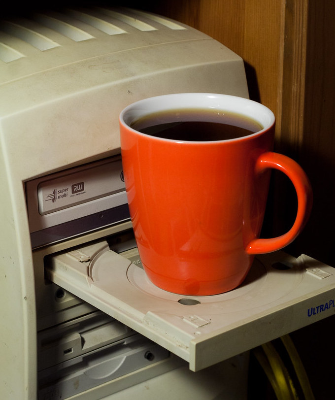

> "You've got to start with the customer experience and work back towards the technology, not the other way around."
>
>~ Steve Jobs
 
Back in the olden days, we use to have these things called offices.  With people.  Lots of people.  Working.  Often in the same room. 
 
Insanity. 

<!--truncate-->

At tech companies, the walls of these rooms were often lined with quirky wall art featuring quotes from tech visionaries like the one from Steve Jobs above. We were encouraged to ["Think like a customer"][think-like-customer] and build software that ["Blows our customers minds"][blow-minds]. These posters had an osmotic effect, with customer centricity seeping deep into our sub-conscience.   
 
The playbook was simple.  Identify what the customer wants, and then deliver it.  Preferably with a user experience that was somewhat palatable. 
 
> "The power has shifted to the customer and it's not coming back."
>
>~ Geoffrey Moore, from Crossing the Chasm

This declaration, made 30 years ago (holy shit, how's that a thing?) officially rung in the age of customer centricity. The message was clear--put the customer at the core of your business, or be prepared for your inevitable demise.  

This had some pretty profound implications for how we built software. 

## The servicification of software
 
Turns out, most customer interactions are not that differentiated.  Customer needs, on average, are fairly predictable. By digitizing them with software, we could serve more customers, faster, and with less variability in the quality of service. 
 
The goal was to digitize every aspect of the business as fast as possible.  Those who digitized first had an enormous first mover advantage. Everyone copied the best practices from those early leaders, ultimately defining how we build software today.  

**And it's had some nasty unintended consequences.**
 
It all started in 1999 when Salesforce launched the worlds first software-as-a-service (SaaS) company.  Before Salesforce, people  had to walk into a store to buy software on molded plastic discs called CDs. These CDs were unwrapped and inserted into a little tray on your computer (that conveniently doubled as a drink holder). Once retracted, the computer would beam a laser at the disc, initiating the installation sequence.  That is, assuming you had space on your local hard drive to accept the files.  And enough RAM to run it.

 
It was an epic time to be alive.
 
SaaS offered a new way of buying and running software over the internet, and it came with many advantages.  It was easier to setup, simple to upgrade, and came at a much lower cost.  Businesses were able to digitize faster than ever.  SaaS took off.
 
Soon, there was SaaS for everything.  Email, calendars, to do lists--everything became SaaS.  Don't want to build a piece of software yourself?  No problem.  Buy some SaaS, integrate it into your workflows, and voila!
 
SaaS became so pervasive that it started to influence the way we built internal software.  In 2011, microservices burst onto the scene as a new architectural paradigm.  The idea was to turn software into interchangeable LEGO blocks. Each LEGO was a small, independent service that could be snapped together with other LEGO pieces to solve a distinct problem. 
 
The cool thing about microservices was they were re-usable.  This meant they could be reconfigured and rearranged across many different permutations.  This led to a massive leap forward in both horizontal and vertical scalability. 
 
The marriage of internal microservices and SaaS [took digitization to 11][eleven].  Your software, my software, it didn't matter.  Grab the right LEGO piece, plug it in, and let's go.  

This interchangeability allowed developers to solve problems with unparalleled speed.  Products could be built in days or weeks instead of years.  Specialization drove efficiency, and soon every aspect of the business was digital.

## The commoditization of services
 
Now in order for these services to truly "stand alone", they need to be self-contained, shippable units of code.  That means an independent application, database, and API.
 
But in a world of hyper specialized, interchangeable building blocks, software is quickly commoditized.  A red LEGO is the same as any other red LEGO.  That's the whole point.  It's this commoditization of software that allows us to rapidly innovate. 
 
**But commoditization isn't a great business strategy.**

So SaaS businesses started looking for ways to differentiate.  And most businesses chose to differentiate through data.
 
Today's SaaS companies look to ingest as much data as possible while limiting data egress. Companies drive up switching costs by making it hard or expensive (or both) to move your data to a competitive product.  The biggest data silos win -- or so the thinking goes.
 
So we've now entered a world where a) everything is SaaS, and b) proprietary data is the primary SaaS differentiator.  This has driven data fragmentation as everyone fights to become the "system of record" for their corner of the application universe.  

In practice, this means your customer data is now spread across tens of applications.  And these applications have economic incentives against data integration.  Without the free movement of data, customer experiences suffer.
 
**This is why companies are now spending hundreds of millions of dollars to get a "holistic view" of their customers.**

## Customer centric software architecture
 
But what if we channeled our inner Steve Jobs and optimized software development to deliver the best possible customer experience?  What would that architecture look like?
 
In our opinion the answer is clear--it would look very different than what we have today.  
In fact, it would look a lot like web3.

- Centralized customer data (owned and controlled by your business).
- Localized runtime data (owned and controlled by the SaaS provider).
- SaaS applications as "views" or different ways of interacting with the data.

In this model, SaaS providers differentiate based on how they interact with your customer data.  The best companies are those whose software makes the data actionable. The value no longer resides in data capture, but rather in data interpretation. 
 
And there can be many interpretations of the same data elements.  Let's say you buy a book at your favorite online bookstore.  The metadata from that sale is used one way by your accounting software and consumed in a completely different context by your marketing tools.  Then when your customer wants to return the book, your customer support tools internalize the data in yet another way.  
 
One transaction.  One set of data.  Three distinct views and interpretations.  And the free-flow of information makes this possible.
 
By bringing all your customer data into a single location, you're  able to create a 360-degree view of your relationship. You're able to build much richer application experiences, because you have access to a much richer set of data.  You have full context of your relationship with your customer.
 
## Data platform > Data lake
 
Recently, we've witnessed "The great recentralization" of customer data into data lakes.  Data pipelines are created to suck all the data out of the various LEGO pieces and stuff it into a centralized database for safe keeping.  

This works great for offline analysis. Big data teams have done well in getting smarter about customer preferences and behavior. But in order for these insights to be useful, they have to make their way from offline analysis mode into an online application.
 
Reverse ETL tools, to their credit, have tried to bridge this gap. But for this to work, the application needs to know how to interpret and act on the data.

**And today's SaaS tools are not built to do this.**  

Zendesk has no idea how to interpret the conversation you just had with your sales rep on Whatsapp. And your marketing platform has no idea how to interpret why you suddenly churned after a negative support experience.

## Centralized customer data, decentralized apps
 
An architecture based on centralized customer data and decentralized applications literally puts the customer at the center of the software we build. And to do this right requires a set of new tools and frameworks for developers to use as they build their applications.  

**That's what we're building with customerOS.** 
 
customerOS is an open source development framework that makes it easy to get a complete 360-degree view of your customers. We bring together behavioral, demographic, transactional, conversational, and social data to give you the most comprehensive view of your customer relationship.
 
And we do it in a way that puts customer privacy at the core of everything we do. In the world of GDPR, HIPPA, CCPA, ad blockers, and cookie deprecation, companies can no longer rely on third party data collection and enrichment.  Gone are the days of hosting your data in fragmented, third party systems.  CustomerOS is built around self-hosted, first party data collection, integration, and retention. Plus a complete development toolkit built over our GraphQL API to make it easy to build applications over the top of your data.
 
This is the future.  And we'd love for you to join us!  Check out our [GitHub repo][customer-os] and smash that star button.
 
>"People ask me to predict the future, when all I want to do is prevent it. Better yet, build it. Predicting the future is much too easy, anyway. You look at the people around you, the street you stand on, the visible air you breathe, and predict more of the same. To hell with more. I want better."
>
>~ Ray Bradbury, from Beyond 1984: The People Machines

<!--References-->

[blow-minds]: https://startupvitamins.com/products/poster-aaron-levie-what-will-blow-our-customers-minds
[customer-os]: https://github.com/openline-ai/openline-customer-os
[eleven]: https://www.youtube.com/watch?v=KOO5S4vxi0o
[think-like-customer]: https://startupvitamins.com/products/poster-think-like-a-customer
