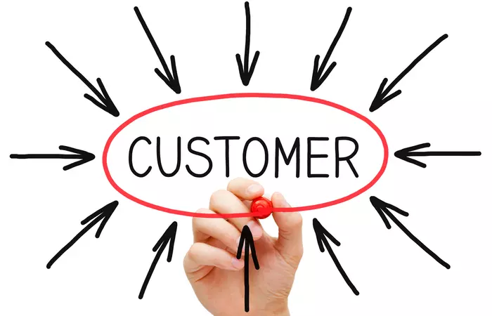
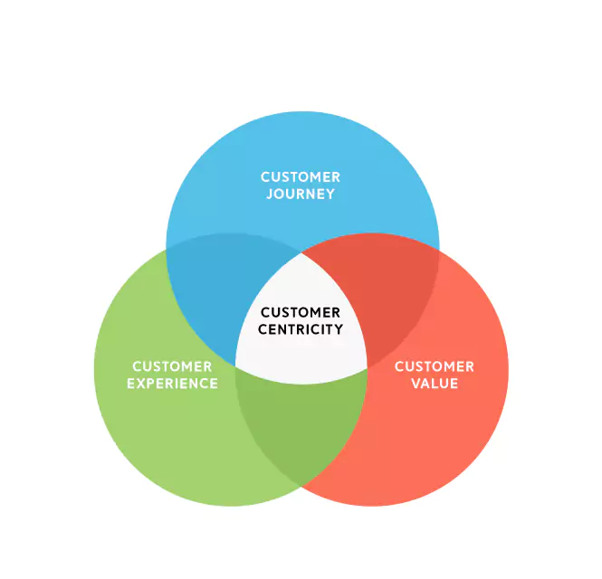

> "You've got to start with the customer experience and work back towards the technology, not the other way around."
>
>~ Steve Jobs
 
Back in the olden days, we use to have these things called offices.  With people.  Lots of people.  Working.  Often in the same room. 
 
Pure insanity. 

<!--truncate-->

The walls were adorned with inspiring quotes from visionaries like Steve Jobs. We were encouraged to ["Think like a customer"][think-like-customer] and build software that ["Blows our customers minds"][blow-minds]. The message was clear: put yourself in the customers' shoes and build software that transforms user experiences.

## The customer centric revolution
 
> "The power has shifted to the customer and it's not coming back."
>
>~ Geoffrey Moore, from Crossing the Chasm

This declaration, made 30 years ago, officially rung in the age of customer centricity. The message was clear--put the customer at the core of your business or risk falling behind.  

This shift led to significant changes in how we thought about software. 

## The servicification and commoditization of software
 
Salesforce, the first software-as-a-service (SaaS) company, revolutionized how we buy and use software. SaaS offered numerous advantages, including ease of setup, simple upgrades, and lower costs. The introduction of microservices allowed developers to create software in a modular, interchangeable way.

However, the standardization of software posed challenges. Companies needed to differentiate themselves, often through proprietary data (data lock-in). This led to data fragmentation across the business and hindered the free movement of data, negatively impacting customer experiences.

## A fresh approach to customer-centric software architecture

But what if we built software with the customer experience as the top priority? What would that look like?

A customer-centric architecture might include:

- Centralized customer data, owned and controlled by your business
- Localized runtime data, owned and controlled by the SaaS provider
- SaaS applications as "views" or different ways of interacting with the data

In this model, companies would differentiate themselves on how they interact with the customer data, enabling richer application experiences that are hyper focused on the problem(s) they are trying to solve.

## Data platforms: Shaping the future of customer experience management

Data lakes have become popular for centralizing customer data, but are limited in their ability to provide real-time insights for applications. This has given rise to the "Modern Data Stack", which we view as transition technology.  To be truly customer centric in our architecture requires new tools and frameworks for developers.

This is why we've built [customerOS][github]: an open-source development framework offering a complete 360-degree view of your customers. With customer privacy at its core, customerOS is designed for self-hosted, first-party data collection, integration, and retention.

## Join us in building the future of customer-centric software

Embrace the future of customer-centric software development with customerOS. [Schedule a demo][demo] and join us in our mission to revolutionize the way we build software for the ultimate customer experience.
 
>"People ask me to predict the future, when all I want to do is prevent it. Better yet, build it. Predicting the future is much too easy, anyway. You look at the people around you, the street you stand on, the visible air you breathe, and predict more of the same. To hell with more. I want better."
>
>~ Ray Bradbury, from Beyond 1984: The People Machines

<!--References-->

[blow-minds]: https://startupvitamins.com/products/poster-aaron-levie-what-will-blow-our-customers-minds
[demo]: /
[github]: https://github.com/openline-ai
[think-like-customer]: https://startupvitamins.com/products/poster-think-like-a-customer
